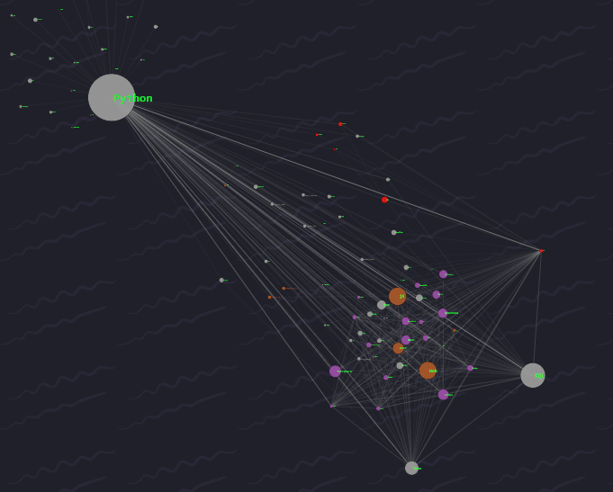
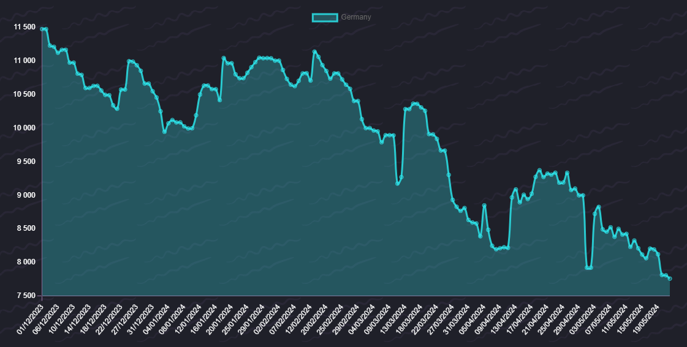

# Qualifey
## Repository Description
This repository contains a program developed to analyze and evaluate labor market dynamics using job vacancy scraping techniques. The program focuses on the IT sector and gathers data from various sources to provide valuable insights for employers, recruiters, and analysts.

## Key Features:
- **Labor Market Analysis**: In-depth analysis of the current state of the IT labor market, including demand and supply dynamics, required skills.
- **Scraping Technology**: Utilizes scraping techniques to efficiently collect and process job vacancy information.
- **Innovative Tool**: An essential resource for employers to make informed decisions and develop strategic human resource management plans based on up-to-date vacancy data and market trends.
- **Effective Data Storage**: Implements a database schema for efficient storage and processing of labor market information.

The conclusions of the study indicate that the developed tool is a significant step towards creating an innovative and practical solution for labor market analysis. The results can serve as a foundation for further research and the implementation of new approaches in labor market analysis and human resource management.

Required Python 3.9+

